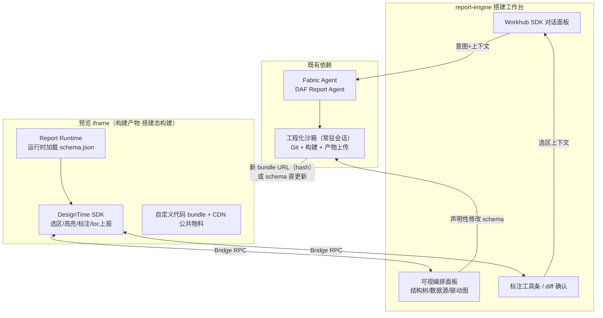
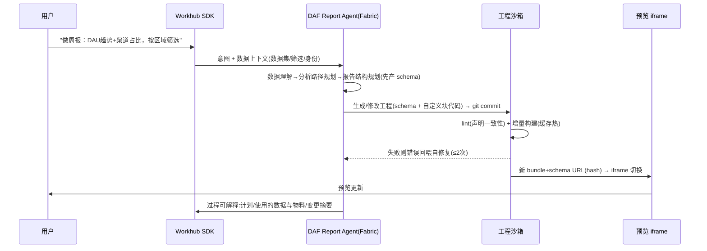

# AI Native 智能报告搭建：搭建态与运行态技术方案

> 范围：**智能搭建态（DesignTime）+ 运行态（Runtime）**。Agent 平台（Fabric）、对话前台（Workhub SDK）、数据服务（DAF）、存储（GitLab/NOS）、监控作为既定依赖边界，不在本方案展开。
> 形态基线：每个报告对应一个 Git 仓库，沙箱拉取仓库进行代码开发，构建产物发布 CDN，集成进 DAF 报告系统。核心目标：**搭建效率** 与 **报告产出效果**。

---

## 1. 定位与核心主张

### 1.1 产品形态与技术命题

用户主要通过 AI 对话生成报告（对话出大局）；页面标注修改与组件拖拽用于补偿对话无法精确调整的劣势（标注/拖拽出精度）。技术上对应两条修改管线：

| 管线 | 触发 | 内容 | 时延 |
| --- | --- | --- | --- |
| **构建管线** | 对话/标注中的代码性修改 | Agent 改工程代码 → 沙箱增量构建 → 产物切换 | 10s 级 |
| **schema 直更新管线** | 布局拖拽、物料拖入、props/数据参数调整 | 确定性改 schema → 仅上传 schema 文件 | ≤ 2s，零构建 |

**对话精度劣势的真正解药是声明层的确定性修改，标注与拖拽只是入口。**

### 1.2 工程出码形态下的核心矛盾与解法

工程出码给 AI 最大业务表达自由，但纯代码工程对平台是黑盒——可视编排没有数据来源、联动无法治理、数据口径无法静态校验、资产无法结构化沉淀。解法是把"协议轻治理"具体化为工程内的结构声明文件 `report.schema.json`，作为**结构半权威层**：

> **块边界、数据源、联动、权限引用必须声明；块内部代码完全自由。**
> 声明与代码的一致性由构建期 lint 强制（AST 扫描比对声明），运行期由 Runtime 兜底（未声明的数据源拒绝执行）。

一份 schema 同时支撑五件事：可视编排视图渲染、标注的块级定位、发布校验的静态扫描入口、Manifest 自动生成、资产沉淀的结构化索引。

### 1.3 设计原则

1. **结构声明、代码自由**：治理抓手在 schema/Manifest，不伸进块内部代码。
2. **协议兼容 lowcode schema**：`report.schema.json` 就是一份合法的 LCE 页面 schema，平台语义全部以 `x-` 前缀扩展字段承载——标准 LCE 设计器/渲染器可直接解析，低码资产与 AI 资产共用一套协议底座。
3. **一切修改走工程**：对话、标注、可视编排产生的变更，最终都是对工程的一次 Git 提交（改代码或改 schema），统一版本、撤销、审计模型。
4. **Runtime 即契约**：AI 生成代码必须通过 Runtime API 取数/通信/调状态，禁止裸 fetch / 全局变量——这是性能治理、权限治理、可观测的前提，由工程规范 + lint + 沙箱三层强制。
5. **模块插拔**：Runtime 内核极小，八类能力皆为可插拔模块，按报告场景裁剪。
6. **短期 iframe、长期原生**：AIReportBlock 先以 iframe 沙箱接入低码，Runtime 与 Bridge 协议按"可原生承载"设计，迁移不重写。
7. **双管线分流**：产物 = `bundle.js`（自定义代码）+ `schema.json`（结构声明）分离部署，schema 由运行时加载；声明性修改零构建生效，代码修改才进构建管线。

---

## 2. 搭建协议（report.schema.json + Manifest + 工程规范）

### 2.1 工程项目规范

runtime 与构建配置封装为 npm 包，仓库内模板代码最小化——千级仓库的批量升级 = 自动化 PR 改版本号 + 发布校验回归兜底。

```
daf-report-{id}/                # 由模板仓库 fork 生成（create-daf-report 脚手架）
├── report.schema.json          # 搭建协议：LCE 兼容页面 schema（本节核心）
├── src/
│   ├── blocks/                 # 自定义区块代码，一区块一目录
│   │   └── TrendBlock/
│   │       ├── index.tsx
│   │       └── style.module.css
│   ├── components/             # 工程内复用组件（候选沉淀为公共物料）
│   └── data/                   # 数据转换函数（纯函数，可单测）
└── package.json                # 依赖白名单；构建脚本仅一行引用 @daf/report-scripts
```

- **runtime/构建进 npm 包**：`@daf/report-runtime`（运行时内核与模块）、`@daf/report-scripts`（构建/lint/manifest 派生，仓库内零配置）。报告入口由 scripts 注入标准模板，工程内无样板代码。
- **产物分离部署（双管线的物理基础）**：构建产出 `bundle.js` + `schema.json` + `manifest.json`（构建期派生），分别上传 NOS/CDN，hash 寻址。schema 可独立更新发布，不触发 bundle 重建。
- **物料两级打包策略**：
  - **公共物料、模板组件**（`componentsMap` 中带 package 声明的，如 `@daf-materials/*`）：作为共享运行时依赖走 CDN（import map / UMD shared），**不打进 bundle**——物料升级不需重建报告仓库，物料拖入不需要构建。
  - **报告自定义组件**（`src/blocks`、`src/components`，仅当前报告使用）：**直接打入 bundle**——无独立发包成本，随报告版本一体管理。
  - 自定义组件被沉淀为公共物料后，componentsMap 切换为 package 引用、仓库内代码删除，自动完成"自定义 → 公共"的资产升级。
- 依赖白名单：package.json 由 lint 校验，白名单外依赖构建失败（安全 + 体积）。
- AI 修改边界：`src/**` 与 `report.schema.json` 可改；package.json 依赖区、构建配置不可改。

### 2.2 report.schema.json（LCE 兼容的结构半权威层）

**协议立场：完全兼容 lowcode schema。** 文件即标准 LCE 页面 schema（`componentsMap` / `componentsTree` / `dataSource` / `state`），平台语义一律以 `x-` 前缀扩展字段挂在节点或页面上——标准引擎解析时忽略扩展字段，存量低码设计器可直接打开本协议。声明层语义上分三段：**块**（componentsTree 一级子节点）、**数据**（dataSource + x-filters）、**联动**（x-linkages）。

```jsonc
{
  "version": "1.0.0",

  // 物料引用映射（LCE 标准）：公共物料走 CDN 共享，不打包
  "componentsMap": [
    { "componentName": "PieChart", "package": "@daf-materials/charts",
      "version": "^1.3.0", "exportName": "PieChart" },
    // AIBlock：注册进物料体系的标准容器组件，承载自定义代码块
    { "componentName": "AIBlock", "package": "@daf/report-runtime", "exportName": "AIBlock" }
  ],

  "componentsTree": [
    {
      "componentName": "Page",
      "props": { "title": "周度经营报告" },
      "x-layout": { "mode": "grid", "cols": 12 },

      // 页面状态（LCE 标准）：筛选值落 state
      "state": { "f_region": "all" },

      // 数据源（LCE 标准 dataSource 区段；x- 字段为平台增强）
      "dataSource": {
        "list": [
          {
            "id": "ds_dau",
            "type": "daf-query",
            "options": {
              "datasetId": "metric_dau",
              "fields": ["date", "dau"],          // 引用字段显式声明 → 字段权限可静态扫描
              "params": { "region": { "type": "JSExpression", "value": "this.state.f_region" } }
            },
            "x-trigger": "auto"                    // auto | manual | lazy
          },
          { "id": "ds_channel", "type": "daf-query",
            "options": { "datasetId": "metric_channel", "fields": ["channel", "uv"],
              "params": { "region": { "type": "JSExpression", "value": "this.state.f_region" } } },
            "x-trigger": "auto" }
        ]
      },

      // 全局筛选器（平台扩展）：声明筛选项与 state 的对应
      "x-filters": [
        { "id": "f_region", "label": "区域", "stateKey": "f_region",
          "valueType": "enum", "optionsFrom": "ds_regions", "default": "all" }
      ],

      // 联动（平台扩展）：声明式优先；代码联动必须登记（治理可见）
      "x-linkages": [
        { "id": "lk1", "source": "node_channel.click", "action": "setState",
          "target": "f_region", "mapping": "payload.name" },
        { "id": "lk2", "source": "node_trend.drill", "action": "custom",
          "handler": "src/blocks/TrendBlock#onDrill" }
      ],

      // 块 = 一级子节点（LCE 标准节点 + x- 扩展）
      "children": [
        {
          "id": "node_trend",
          "componentName": "AIBlock",              // 自定义代码块：AIBlock 容器加载 bundle 模块
          "title": "DAU 趋势",
          "props": { "entry": "blocks/TrendBlock", "smooth": true },
          "x-position": { "x": 0, "y": 1, "w": 8, "h": 6 },
          "x-consumes": ["ds_dau"],                // 声明消费的数据源（DataRuntime 执行依据）
          "x-listens": ["f_region"],
          "x-emits": ["drill"]
        },
        {
          "id": "node_channel",
          "componentName": "PieChart",             // 公共物料块：标准节点直接渲染
          "title": "渠道占比",
          "props": {
            "donut": false,
            "series": { "type": "JSExpression", "value": "this.dataSourceMap['ds_channel'].data" }
          },
          "x-position": { "x": 8, "y": 1, "w": 4, "h": 6 },
          "x-consumes": ["ds_channel"], "x-listens": ["f_region"], "x-emits": ["click"]
        }
      ]
    }
  ]
}
```

兼容性要点：

- 数据绑定用 LCE 规范形态 `JSExpression + this.dataSourceMap[...]`，存量低码渲染链路可直接消费。
- 自定义代码块通过 `AIBlock` 容器组件接入——它本身是注册进物料体系的标准物料，低码页面同样可以使用（即 AIReportBlock 的协议形态）。
- 平台扩展一律 `x-` 前缀，协议升级不破坏标准字段；反向地，任何合法 LCE schema 也可被本平台加载（扩展字段缺省时按默认治理策略处理）。

**声明-代码一致性（lint 规则，构建门禁）**：

| 规则 | 检查方式 |
| --- | --- |
| 块只消费声明的数据源 | AST 扫描 `runtime.data.query()` 调用的 dsId ∈ x-consumes |
| 禁止裸 fetch/XHR/WebSocket | AST 黑名单（Runtime API 是唯一取数通道） |
| 字段引用 ⊆ dataSource fields 声明 | 转换函数字段访问扫描（尽力静态 + 运行期审计兜底） |
| x-emits/x-listens 与代码一致 | `runtime.event.emit/on` 调用扫描 |
| 依赖白名单、包体积预算 | package.json + 构建产物体积阈值 |

### 2.3 Manifest（模块对外能力声明）

AIReportBlock 嵌入低码、报告间组合、资产检索都消费 Manifest。**字段由 schema 构建期派生**，避免双写漂移：

```jsonc
{
  "name": "weekly-biz-report",
  "version": "1.4.0",
  "artifact": { "bundle": "cdn://.../bundle.{hash}.js", "schema": "cdn://.../schema.{hash}.json" },
  "inputs":  [ { "name": "region", "type": "string", "bindTo": "state.f_region" } ],
  "outputs": [ { "name": "drill", "payload": "DrillEvent" } ],
  "actions": [ "reload", "setFilter", "highlight", "exportPDF" ],
  "dataSources": [ { "datasetId": "metric_dau", "fields": ["date","dau"] } ],   // 派生自 schema
  "permissions": { "datasets": ["metric_dau","metric_channel"], "actions": ["export"] },
  "runtime": { "requires": ["data","state","event"], "minVersion": "0.3" }
}
```

### 2.4 物料复用（低码资产 ↔ AI 资产）

- 公共物料沿用 LCE componentMeta，扩展 `x-ai` 语义块（summary/useWhen/avoidWhen/examples），入物料索引供 Agent 检索。
- **Comp Skill 的实现 = 物料检索 + 节点声明生成**：AI 生成块时优先公共物料标准节点，其次 import 物料二次封装（进 bundle），最后才全量手写——prompt 与 lint 双重引导（手写前需检索失败证明）。
- 反向沉淀：`src/components` 中被多工程复制的组件，由资产飞轮识别 → 补 meta → 发布为公共物料 → componentsMap 切换引用。

---

## 3. 搭建态（DesignTime）设计

### 3.1 总体结构

智能搭建画布 = report-engine 宿主页 + iframe 加载工程预览产物。**DesignTime SDK 随搭建态构建注入产物内**（运行态构建不含，零线上开销）：



### 3.2 标注选区：构建期注入 + 两级定位

构建插件（搭建态 only）注入两级定位信息：

- **块级**：每个块根元素注 `data-node-id`（来源 schema 节点 id，稳定）。
- **源码级**：自定义块内部 JSX 元素注 `data-loc="src/blocks/TrendBlock/index.tsx:42:8"`（babel 转换，类 react-dev-inspector）。

选区交互（DesignTime SDK 实现）：点选默认命中**块级**（与 schema/可视编排对齐）；同位置再次点击下钻到源码级元素，面包屑沿 `块 > 元素` 上扩；框选多块得节点列表（支撑"这两个图对齐/统一配色"）；悬浮高亮、选中态、标注 pin 走独立 overlay 层，不侵入业务 DOM。

**选区上下文包**（经 Bridge 上报宿主，由 Workhub SDK 注入对话）：

```jsonc
{
  "selection": {
    "level": "block",                      // block | element
    "nodeId": "node_trend",
    "loc": "src/blocks/TrendBlock/index.tsx:42:8",   // element 级才有
    "schemaSlice": { /* 该节点的 schema 声明 */ },
    "sourceSlice": "...(自定义块的相关源码片段，沙箱按 loc 提取)...",
    "screenshot": "nos://...",             // 截选区，多模态增强
    "runtimeState": { "consumedData": { "ds_dau": { "rowCount": 30, "sample": [/*…*/] } } }
  },
  "page": { "schemaOutline": { /* 块/数据源/联动摘要 */ } }
}
```

`runtimeState` 是工程出码形态独有的优势：把**真实数据形状**喂给 AI，修改图表配置/数据处理时准确率显著提升。

### 3.3 Bridge 协议（宿主 ↔ iframe RPC）

postMessage 之上的 JSON-RPC，握手带版本协商与会话 token（防嵌套页面伪造）。**协议按"长期原生承载"设计：原生化后同一接口改为直接函数调用，宿主与 SDK 代码不变。**

| 方向 | 方法 | 用途 |
| --- | --- | --- |
| 宿主→SDK | `designtime.enable(mode)` | 进入标注/浏览模式 |
| 宿主→SDK | `designtime.highlight(nodeId|loc)` | 对话中提及定位时画布高亮（双向锚定） |
| 宿主→SDK | `designtime.getSchema()` / `getSelection()` | 可视编排数据源 |
| SDK→宿主 | `designtime.onSelect(ctx)` | 选区上下文上报 |
| SDK→宿主 | `runtime.onEvent(evt)` | 块事件外抛（嵌低码时联动用） |
| 宿主→SDK | `runtime.action(name, payload)` | reload / setFilter / highlight / openDetail |
| 宿主→SDK | `theme.sync(tokens)` / `viewport.sync(size)` | 主题/尺寸同步 |
| SDK→宿主 | `data.queryProxy(req)` | （嵌低码场景可选）查询经宿主代理，权限上下文统一 |

### 3.4 三条搭建链路

**链路一 · 对话搭建（主链路）**



关键约定：**Agent 先产 schema、后产代码**（结构规划显性化，schema 即计划的落盘），生成代码受 schema 声明约束；每轮修改一个 git commit，commit message 结构化（intent/触及节点/变更类型）；冷启动从模板仓库 fork，AI 只生成业务块（token 省一个量级、风格统一、错误面小）。

**沙箱资源模型与时延预算**（每轮构建产物模式的体验底线）：

| 环节 | 策略 | 预算 |
| --- | --- | --- |
| 沙箱冷启动 | 预热池：基础镜像预装通用依赖；会话开始即分配 | ≤ 5s（仅首轮） |
| 会话期间 | 沙箱常驻保活（仓库已拉、依赖已装、构建缓存热），空闲超时回收 | — |
| 增量构建 | esbuild/Vite build + 持久缓存，仅自定义块参与（公共物料/runtime 为外部依赖） | ≤ 5s |
| 产物上传 | bundle/schema 并行直传 NOS/CDN，hash 寻址 | ≤ 2s |
| 预览刷新 | iframe 切新 URL；schema 直更新则运行时重载 schema 即可 | ≈ 即时 |
| **声明性修改全链路** | **不进构建管线，仅上传 schema.json** | **≤ 2s** |

**链路二 · 标注修改（辅）**

选区上下文包（§3.2）注入对话 → 用户说改法 → Agent 判定修改类型：

| 修改类型 | Agent 动作 | 管线 / 时延 |
| --- | --- | --- |
| 声明性（props/位置/标题/数据源参数/声明式联动） | 只改 `report.schema.json` | schema 直更新，零构建，≤2s |
| 代码性（样式/交互/数据处理） | 改自定义块源码（diff 最小化） | 增量构建 + 产物切换，10s 级 |
| 结构性（增删块/换组件/改联动） | schema + 代码联动修改 | 视是否涉码走对应管线 |

修改完成后宿主展示**双 diff**：schema diff（jsondiffpatch 渲染）+ 代码 diff（按文件折叠），破坏性变更（删块/删数据源）先确认再提交。

**链路三 · 可视编排 + 拖拽（辅，第一期范围 = 布局调整 + 物料拖入）**

可视编排面板 = schema 的三个投影视图：**结构树**（块层级与布局）、**数据源视图**（dataSource/x-filters 及块消费关系）、**联动图**（x-linkages 有向图，含代码联动登记项）。操作分两类：

- **声明性操作直接改 schema（零 AI、零构建，≤2s 生效）**：
  - **布局拖拽**：画布上拖块调位置/大小/排序（x-position），overlay 层实现，确定性回写 schema；
  - **物料拖入**：从物料面板拖公共物料进画布 = componentsMap 增引用 + children 插标准节点（含默认 props 与数据绑定向导），runtime 按声明直接挂载 CDN 物料——**不生成代码、不触发构建**，体验与低码平台一致；
  - 改 props、改数据源参数、增删声明式联动。
- **结构性操作经 Agent**：新增自定义块（"在这里加一个留存漏斗"）、把代码联动改为声明式——转成对话指令走链路一。

### 3.5 版本、撤销与多轮迭代

- **一轮修改 = 一个 commit**；撤销 = revert commit + 切换到该 commit 的产物（产物按 commit hash 缓存，**回滚即秒级切 URL**，无需重建）。
- 会话内时间线 UI：每轮显示 intent / diff 摘要 / 预览快照缩略图，点任意节点回到该版本继续。
- 报告级版本：发布时打 tag；草稿/发布双指针沿用 DAF 现有模型。

### 3.6 搭建过程可解释

Agent 每轮输出结构化"过程卡"随消息渲染（Workhub SDK 自定义气泡）：使用的数据集与字段口径、选用的物料/Skill 及理由、schema/代码变更摘要、未满足项与建议。数据口径解释直连 DAF 知识库。

---

## 4. 运行态（Report Runtime）设计

### 4.1 内核与插拔机制

```ts
// @daf/report-runtime —— 内核 < 500 行，能力全部模块化
interface RuntimeKernel {
  use(mod: RuntimeModule): void;                 // 注册模块
  init(ctx: RuntimeContext): Promise<void>;      // 按依赖序初始化
  get<T = unknown>(name: string): T;             // 模块获取：runtime.get<DataRuntime>('data')
  dispose(): void;
}
interface RuntimeModule {
  name: string;                                  // 'data' | 'state' | ...
  deps?: string[];                               // 模块依赖
  setup(kernel: RuntimeKernel, ctx: RuntimeContext): void | Promise<void>;
  dispose?(): void;
}
interface RuntimeContext {
  schema: ReportSchema;                          // 运行时 fetch 的 schema.json
  manifest: Manifest;
  env: 'design' | 'preview' | 'production';
  host: HostBridge | null;                       // iframe 模式为 Bridge，原生模式为直连
  user: UserContext;                             // 身份/租户/权限上下文（Workhub 透传）
}
```

- 报告入口按 manifest.runtime.requires 装配模块；监控、日志等横切模块由平台配置注入，业务工程无感。
- **schema 运行时加载**（产物分离部署）：runtime 启动时 fetch `schema.json`，公共物料节点按 componentsMap 从 CDN 共享依赖挂载，AIBlock 节点从 bundle 取模块挂载——schema 单独更新即可改变页面结构与配置，这是声明性修改零构建生效的运行时基础。
- **AI 代码的唯一世界接口是 `runtime`**：取数 `runtime.data`、状态 `runtime.state`、事件 `runtime.event`……lint 保证不存在第二条通道，治理因此可能。

### 4.2 模块接口定义（P0 四件套 + P1）

**DataRuntime（P0，最核心）**

```ts
interface DataRuntime {
  query(dsId: string, opts?: QueryOpts): Promise<QueryResult>;  // 仅允许 schema 声明的 dsId
  reload(dsId: string): Promise<void>;
  watch(dsId: string, cb: (r: QueryResult) => void): Unwatch;   // 数据变化订阅（声明式消费）
}
interface QueryOpts { params?: Dict; signal?: AbortSignal; page?: PageReq }
```

内置治理（对接 DAF 查询 API，全部可配置）：

| 能力 | 默认策略 |
| --- | --- |
| 去重 | 相同 dsId+params 的并发请求合并（in-flight dedupe） |
| 缓存 | 按 dsId+params LRU，TTL 可声明；筛选回切秒出 |
| 取消 | 筛选变更自动 abort 上一轮未完成查询 |
| 超时/熔断 | 单查询超时（默认 30s）；同 dataset 连续失败 N 次熔断降级到错误态 |
| 依赖刷新 | dataSource params 中的 state 引用构建依赖图：筛选变化 → 拓扑序自动 reload 下游（x-trigger:auto） |
| 并发预算 | 页面级最大并发查询数（默认 6），防 AI 生成代码循环触发查询风暴 |
| 审计 | 每次查询上报 datasetId/queryId/参数摘要/耗时/行数 → LoggerRuntime |

**StateRuntime（P0）**：`get/set/watch`，承载筛选、钻取、选中、弹窗等跨块状态；由 schema state 初始化，set 触发 DataRuntime 依赖刷新；嵌低码时经 Bridge 与宿主状态对齐（Manifest inputs 映射）。

**EventRuntime（P0）**：块间事件总线 `emit/on`，事件名约束为 schema `x-emits/x-listens` 声明集；每次 emit 落审计日志（联动可追溯）。声明式 linkage 由内核初始化时自动订阅装配（`source → action(target)`），代码联动走显式 `on`。

**PermissionRuntime（P0）**：`can(action, resource)` 同步判定 + 初始化时拉取用户权限快照。分层执行：数据集/字段级裁剪在 **DAF 数据服务侧**强制（前端不可信）；Runtime 负责组件级显隐（无权限块渲染占位）、action 级拦截（export/openDetail）、敏感字段前端兜底脱敏。

**ActionRuntime（P1）**：标准动作注册表 `reload / setFilter / highlight / openDetail / exportPDF / scrollTo`，宿主（低码页/Workhub）经 Bridge 调用，Manifest actions 即此注册表的导出。

**SandboxRuntime（P1）**：见 §4.3。**ThemeRuntime（P1）**：token 注入 CSS variables，宿主 `theme.sync` 热切换；物料与生成代码统一消费 token（工程规范禁止硬编码色值，lint 检查）。**LoggerRuntime（P0，横切）**：统一打点接口，模块内部治理事件（查询/事件/action/异常）自动上报，对接现有监控平台；性能监控（首屏/块渲染/查询/交互耗时）作为独立插拔模块基于 Logger 实现。

### 4.3 沙箱与隔离：短期 iframe、长期原生

| 阶段 | 形态 | 隔离手段 | 适用 |
| --- | --- | --- | --- |
| 短期 | AIReportBlock = sandboxed iframe 加载产物 | 浏览器原生隔离（无 same-origin）；Bridge 白名单通信；CSP 锁 CDN 域 | AI 报告嵌低码、独立报告页 |
| 长期 | 产物构建为 ESM 模块，宿主进程内挂载 | 构建期：依赖白名单 + AST 危险 API 扫描 + CSS Modules 强制作用域；运行期：Runtime 唯一通道 + 全局对象冻结 | 通过质量门禁的报告/组件 |

**迁移不重写的设计保证**：① Bridge 协议接口在原生模式下实现为直接调用（§3.3）；② 工程构建双 target（iframe 产物 / ESM 产物）同源生成；③ 信任分级——新生成报告默认 iframe，运行稳定 + 校验通过后可切原生（性能与联动体验升级），出问题一键降回 iframe。低码与 AI 融合的"沙箱嵌套联动/性能"问题由此获得渐进出路。

### 4.4 错误边界与回滚

- 块级 ErrorBoundary：单块异常不拖垮整页，降级为错误卡片（含 traceId），异常上报 LoggerRuntime。
- 数据错误态：DataRuntime 错误统一抛标准错误对象，块按声明渲染 fallback（skeleton/error/empty）。
- 运行态回滚：线上报告产物 hash 寻址 + Manifest 版本指针，发布回滚 = 切指针，秒级。

---

## 5. 可信发布（发布校验清单）

发布门禁串联静态扫描（基于 schema/Manifest）与动态预检（沙箱试运行）：

| 类别 | 检查项 | 依据 |
| --- | --- | --- |
| 数据口径 | datasetId/字段/指标存在且口径版本最新；口径解释可生成 | schema dataSource × DAF 数据语义 |
| 查询预检 | 全量声明数据源以发布者身份试跑（limit 采样）：可执行、耗时 ≤ 预算、结果非空告警 | 沙箱 + DAF 查询 API |
| 权限扫描 | schema 引用的 dataset/字段 × 目标受众权限域比对；越权引用阻断 | schema × DAF 权限服务 |
| 协议合法 | schema 校验（LCE 标准 + x- 扩展规则）、声明-代码一致性 lint、Manifest 派生一致 | 构建门禁复跑 |
| 性能预算 | 包体积、查询数、首屏渲染（无头浏览器跑产物测 LCP） | 构建产物 + 试运行 |
| 运行冒烟 | 无头浏览器加载产物：零 JS 异常、零失败查询、截图存档（视觉回归基线） | playwright |
| 发布治理 | 灰度（按受众比例）、版本 tag、审计记录、一键回滚 | Manifest 指针 |

校验结果以"发布检查报告"展示给发布者，不通过项分**阻断级**（越权/查询失败/异常）与**告警级**（性能/空结果）。

---

## 6. 分阶段落地

| 阶段 | 交付 | 验收要点 |
| --- | --- | --- |
| **一 · 可用闭环** | 工程规范与模板仓库、npm 化 runtime/scripts、产物分离部署、对话搭建链路（先 schema 后代码 + 自修复循环）、AIReportBlock iframe 接入、沙箱常驻与预热池 | 一句话生成含图表报告并发布集成进 DAF；时延预算表达标 |
| **二 · 可控生成** | 搭建协议定版（LCE 兼容 + x- 扩展）、声明-代码一致性 lint、Runtime P0 四件套、标注修改链路（两级定位 + 双 diff）、布局拖拽 + 物料拖入、真实数据回路与截图自检 | 标注修改意图达成率 ≥ 80%；声明性修改 ≤ 2s；非法产物 100% 构建期拦截 |
| **三 · 可信发布** | 发布校验门禁全集、版本治理（灰度/回滚/审计）、性能监控模块、原生承载试点（信任分级切换） | 发布检查报告上线；阻断级校验零漏报（抽检） |
| **四 · 资产飞轮** | 自定义组件 → 公共物料沉淀链路、模板/Skill 复用统计、golden set 评测扩量与变更门禁 | 物料复用率、AI 一次构建通过率 ≥ 90% |

先行动作：① schema/Manifest 协议 RFC 定稿（多模块依赖它）；② DesignTime 构建插件 PoC（data-loc 注入 + 选区上下文端到端）；③ 沙箱时延基线实测（验证时延预算表可达）。

---

## 7. 风险与对策

| 风险 | 表现 | 对策 |
| --- | --- | --- |
| schema 与代码漂移 | 声明失真，可视编排/校验失效 | 一致性 lint 构建门禁 + Runtime 运行期拒绝未声明数据源 + Agent 修改约定"先 schema 后代码" |
| AI 绕过 Runtime 取数/通信 | 治理失效、性能失控 | AST lint 黑名单 + iframe CSP 锁域 + 代码评审抽检；Runtime API 设计得比裸写更好用（降低绕过动机） |
| 标注定位漂移 | 改码后 loc 失效 | loc 仅单轮会话内使用，每次构建后重新选区；块级 id 来自 schema 稳定不漂 |
| schema 半权威层被架空 | Agent 全写代码不维护声明 | 先 schema 后代码的生成流程 + lint 阻断 + 声明性修改链路给 schema 持续使用价值 |
| 每轮构建产物时延超预算 | 多轮迭代体验差 | 双管线分流（声明性修改不进构建）+ 沙箱常驻/预热池 + 持久构建缓存 + 公共物料/runtime 外置不参与打包 + 产物 hash 缓存秒级回切 |
| 千级仓库批量升级困难 | runtime/安全补丁无法推送 | runtime/构建配置全部 npm 化，自动化 PR 升级 + 发布校验回归兜底 |
| iframe 嵌套联动复杂 | 低码页内多 AIReportBlock 状态错乱 | Bridge 状态映射协议（Manifest inputs 显式声明）+ 联动一律走宿主中转，禁块间私聊 |
| Runtime 模块边界蔓延 | 内核臃肿、升级困难 | 内核 <500 行红线、模块 deps 显式声明、横切能力一律插件化 |

---

## 附录 A · 端到端示例（标注修改一例）

用户点选"渠道占比"饼图 →（块级命中 `node_channel`，上下文含 schema 声明 + 运行数据样本 + 截图）→ 说："改成环形图，点击某个渠道时联动趋势图只看该渠道。"

Agent 判定：① 环形图 = 声明性（物料 props.donut=true）；② 联动 = 声明性 linkage + 筛选器新增——全部落在 schema：

```jsonc
// schema diff（jsondiffpatch 渲染给用户确认）
{
  "children[node_channel].props": { "donut": true },
  "x-linkages[+]": { "id": "lk3", "source": "node_channel.click",
                     "action": "setState", "target": "f_channel", "mapping": "payload.name" },
  "x-filters[+]":  { "id": "f_channel", "label": "渠道", "stateKey": "f_channel", "default": "all" },
  "state[+]":      { "f_channel": "all" },
  "dataSource.list[ds_dau].options.params[+]": {
    "channel": { "type": "JSExpression", "value": "this.state.f_channel" } }
}
```

无代码改动 → schema 直更新管线（零构建，≤2s 生效）→ DataRuntime 依赖图自动接好 f_channel → ds_dau 刷新链 → git commit 一次，可撤销。**高频修改根本不进构建管线，AI 出错面大幅缩小。**

## 附录 B · Runtime 模块清单与优先级

| 模块 | 优先级 | 依赖 | 交付物 |
| --- | --- | --- | --- |
| kernel + Logger | P0 | — | @daf/report-runtime 内核包 |
| DataRuntime | P0 | logger | 查询治理全集（§4.2 表） |
| StateRuntime / EventRuntime | P0 | logger | 状态/事件 + linkage 自动装配 |
| PermissionRuntime | P0 | logger | 组件/action 拦截 + 脱敏兜底 |
| ActionRuntime | P1 | event | 标准动作注册表 |
| ThemeRuntime | P1 | — | token 体系 + 热切换 |
| SandboxRuntime | P1 | — | iframe Bridge 实现 → 原生白名单实现 |
| 性能监控模块 | P1 | logger | 首屏/查询/交互指标 + 告警对接 |
